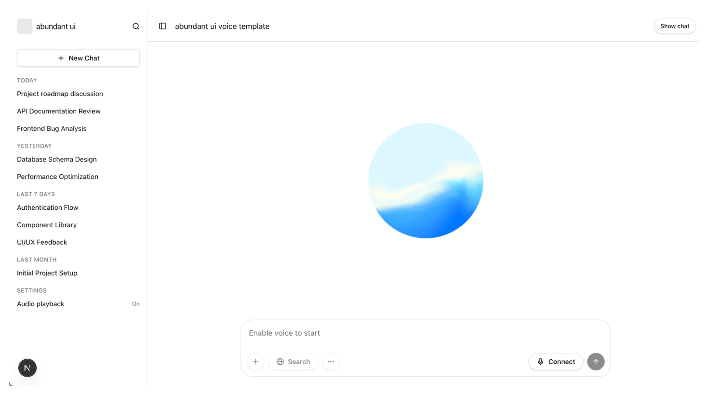
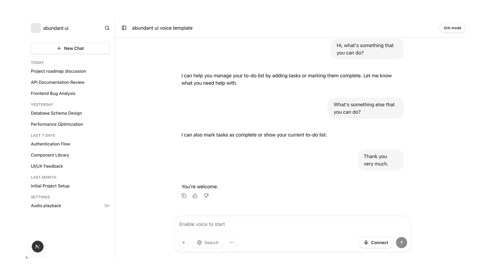

<h1 align="center">Abundant UI Voice Agent Template</h1>

<p align="center">
  A professional-grade, production-ready template for building sophisticated voice-enabled AI agents. This codebase combines the power of the OpenAI Realtime API with a beautiful, high-performance user interface.
</p>

<p align="center">
  
</p>

## Overview

The **Abundant UI Voice Agent Template** is designed for developers who want to build more than just a simple chatbot. It features a robust multi-agent architecture where a "Supervisor Agent" coordinates with specialized agents to handle complex tasks, such as managing a todo list or navigating application state.

## Key Features

- **Fluid Voice Interaction:** Powered by OpenAI's Realtime API for low-latency, natural voice-to-voice conversations.
- **Dynamic Orb Visualization:** A beautiful, shader-based interactive orb that reacts to audio metrics and agent states (Listening, Thinking, Speaking).
- **Multi-Agent Orchestration:** Implements a "Supervisor" pattern to handle complex logic, tool calls, and handoffs between agents.
- **Integrated Tooling:** Comes out of the box with a Todo List example demonstrating how the agent can interact with local application state.

<p align="center">
  
</p>

## Visual Experience

The template includes a high-fidelity transcript view that allows users to follow the conversation in real-time, even while using voice mode.

<p align="center">
  
</p>

## Architecture

This project utilizes a tiered agent approach:
1.  **Junior Agent:** Handles initial user interaction and basic chitchat.
2.  **Supervisor Agent:** An expert-level model that provides guidance, performs complex tool calls, and manages the overall conversation flow.

## Getting Started

### Prerequisites

- Node.js 18+
- An OpenAI API Key with access to the Realtime API.

### Installation

1.  **Clone and Install:**
    ```bash
    git clone <your-repo-url>
    cd abundant-ui-voice-template
    pnpm install
    ```

2.  **Environment Setup:**
    Create a `.env` file in the root directory:
    ```env
    OPENAI_API_KEY=your_api_key_here
    ```

3.  **Run Development Server:**
    ```bash
    pnpm dev
    ```

4.  **Open the App:**
    Navigate to [http://localhost:3000](http://localhost:3000).

## Configuration

Agent configurations, including instructions and tool definitions, can be found in:
`src/app/agentConfigs/`

The main application logic and UI orchestration reside in:
`src/app/App.tsx`

## License

This project is licensed under the MIT License - see the [LICENSE](LICENSE) file for details.

---

<p align="center">
  Built with ❤️ using OpenAI Realtime and Next.js.
</p>
